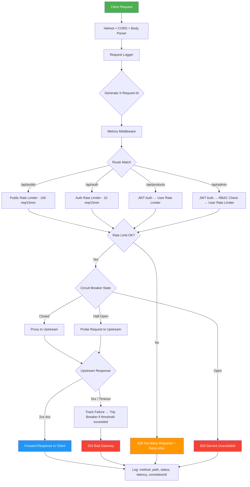

<p align="center">
  
  
  
  
  
</p>

# 🚀 API Gateway

A **production-grade API Gateway** built with Node.js & Express 5 that sits between clients and your microservices. It handles all cross-cutting concerns — authentication, rate limiting, circuit breaking, observability — so your services don't have to.

> **One gateway. Zero boilerplate in your services.**

---

## ✨ Key Features

| Category | Feature | Details |
|---|---|---|
| 🔐 **Security** | JWT Authentication | Bearer token verification with `jsonwebtoken` |
| | Role-Based Access (RBAC) | Per-route role checks extracted from JWT claims |
| | Helmet | Secure HTTP headers (HSTS, CSP, X-Frame-Options) |
| | CORS | Configurable cross-origin resource sharing |
| | Payload Limits | 10 KB cap on request bodies to prevent DoS |
| ⏱️ **Rate Limiting** | Redis-Backed Limits | Distributed rate limiting via `rate-limiter-flexible` + Redis |
| | Per-Route Tiers | Public (100/15m), Auth (10/15m), User (50/15m) |
| | Standard Headers | `X-RateLimit-Limit`, `Remaining`, `Reset`, `Retry-After` |
| | Graceful Fail-Open | Falls back to pass-through if Redis is unavailable |
| 🔌 **Circuit Breaker** | Opossum Integration | Per-upstream breaker with Closed → Open → Half-Open states |
| | Configurable Thresholds | 50% error rate, 5s timeout, 10s reset window |
| | Fallback Responses | 503 (circuit open) or 502 (upstream failure) |
| 📊 **Observability** | Structured Logging | Pino JSON logs with automatic sensitive data redaction |
| | Correlation IDs | `X-Request-Id` generated per request, propagated to upstreams |
| | Prometheus Metrics | Request count, latency histograms, breaker state gauges |
| | Health Check | `GET /health` endpoint for liveness probes |
| 🛡️ **Reliability** | Graceful Shutdown | Drains in-flight requests on `SIGTERM`/`SIGINT`, closes Redis cleanly |
| | Startup Validation | Zod-validated env config — crashes loudly if misconfigured |
| | Path Rewriting | Strips gateway prefix before forwarding to upstream |
| | Header Injection | Forwards `X-Request-Id`, `X-User-Id`, `X-User-Roles` to upstreams |

---

## 🏗️ Architecture

```
                          ┌─────────────────────────────────────────────────┐
                          │                  API GATEWAY                    │
                          │                                                 │
  Client ──────────────▶  │   Helmet ──▶ CORS ──▶ Body Parser (10kb cap)   │
                          │       │                                         │
                          │       ▼                                         │
                          │   Request Logger (pino + X-Request-Id)          │
                          │       │                                         │
                          │       ▼                                         │
                          │   Metrics Middleware (prom-client)               │
                          │       │                                         │
                          │       ▼                                         │
                          │   Route Matcher                                 │
                          │       │                                         │
                          │   ┌───┴───────────────────────────────────┐     │
                          │   │        Per-Route Middleware Chain      │     │
                          │   │                                       │     │
                          │   │  /api/public  → [publicRateLimiter]   │     │
                          │   │  /api/auth    → [authRateLimiter]     │     │
                          │   │  /api/products→ [JWT + userLimiter]   │     │
                          │   │  /api/admin   → [JWT + RBAC + limiter]│     │
                          │   └───┬───────────────────────────────────┘     │
                          │       │                                         │
                          │       ▼                                         │
                          │   Circuit Breaker (opossum, per-upstream)        │
                          │       │                                         │
                          │       │  ┌──────────────────────────┐           │
                          │       │  │  Closed  → normal flow   │           │
                          │       │  │  Open    → 503 fallback  │           │
                          │       │  │  Half    → probe recovery│           │
                          │       │  └──────────────────────────┘           │
                          │       │                                         │
                          │       ▼                                         │
                          │   http-proxy-middleware                          │
                          │   (pathRewrite + header injection)              │
                          │                                                 │
                          └────────────────────┬────────────────────────────┘
                                               │
                        ┌──────────────────────┼──────────────────────┐
                        ▼                      ▼                      ▼
                  ┌──────────┐          ┌──────────┐          ┌──────────┐
                  │ Service A │          │ Service B │          │ Service C │
                  │ :4000     │          │ :4001     │          │ :4002     │
                  └──────────┘          └──────────┘          └──────────┘
```

### Request Flow Diagram



---

## 📁 Project Structure

```
api-gateway/
├── src/
│   ├── index.js                    # Express app, middleware chain, graceful shutdown
│   ├── config/
│   │   ├── env.js                  # Zod-validated environment config
│   │   ├── redis.js                # ioredis singleton client
│   │   └── metrics.js              # prom-client registry + custom metrics
│   ├── middleware/
│   │   ├── auth.js                 # JWT verification + RBAC (requireRole)
│   │   ├── rateLimiter.js          # Redis-backed rate limiting (3 tiers)
│   │   ├── logger.js               # Pino structured logger + request logger
│   │   ├── metricsMiddleware.js    # Per-request Prometheus instrumentation
│   │   └── errorHandler.js         # Global error handler with correlation IDs
│   ├── routes/
│   │   ├── gateway.js              # Route registry + proxy + circuit breaker wiring
│   │   └── metrics.js              # GET /metrics (Prometheus scrape endpoint)
│   └── services/
│       ├── breaker.js              # Opossum circuit breaker factory (singleton per target)
│       └── redisClient.js          # Redis client (legacy, see config/redis.js)
├── tests/
│   ├── auth.test.js                # JWT + RBAC middleware tests
│   ├── rateLimiter.test.js         # Rate limiter logic tests
│   ├── breaker.test.js             # Circuit breaker state tests
│   ├── proxy.test.js               # Proxy routing tests
│   ├── metrics.test.js             # Prometheus metrics tests
│   ├── security.test.js            # Helmet + CORS + payload limit tests
│   ├── errorHandler.test.js        # Global error handler tests
│   ├── rbac.test.js                # Role-based access control tests
│   ├── shutdown.test.js            # Graceful shutdown tests
│   └── setup.js                    # Jest env setup
├── Dockerfile                      # node:20-alpine, production deps only
├── docker-compose.yml              # Gateway + Redis for local dev
├── .env.example                    # Template for required env vars
└── package.json
```

---

## ⚡ Quick Start

### Prerequisites

- **Node.js** ≥ 20
- **Redis** 7+ (or use Docker)

### 1. Clone & Install

```bash
git clone https://github.com/omkarararar/API-Gateway.git
cd API-Gateway
npm install
```

### 2. Configure Environment

```bash
cp .env.example .env
```

Edit `.env` with your values:

```env
NODE_ENV=development
PORT=3000
JWT_SECRET=your_super_secret_key_at_least_16_chars
REDIS_URL=redis://localhost:6379
LOG_LEVEL=info
METRICS_ENABLED=true
```

### 3. Run

**With Docker (recommended):**
```bash
docker compose up --build
```

**Without Docker:**
```bash
# Start Redis first
redis-server

# Start the gateway
npm run dev
```

The gateway will be live at `http://localhost:3000`.

---

## 🧪 Testing

```bash
# Run all tests
npm test

# Watch mode
npm run test:watch

# With coverage report
npm run test:coverage
```

**Test suites cover:**

| Suite | What It Validates |
|---|---|
| `auth.test.js` | JWT verification, missing/invalid tokens, claim extraction |
| `rateLimiter.test.js` | All 3 limiter tiers, Redis failure fallback, header compliance |
| `breaker.test.js` | Circuit state transitions, fallback responses |
| `proxy.test.js` | Path rewriting, header injection, upstream forwarding |
| `metrics.test.js` | Prometheus counter/histogram instrumentation |
| `security.test.js` | Helmet headers, CORS, payload size limits |
| `rbac.test.js` | Role-based route protection |
| `shutdown.test.js` | SIGTERM/SIGINT drain + Redis cleanup |
| `errorHandler.test.js` | Global error catch, correlation ID propagation |

---

## 📡 API Endpoints

| Endpoint | Auth | Rate Limit | Description |
|---|---|---|---|
| `GET /health` | None | None | Liveness probe — returns `{ status: "ok" }` |
| `GET /metrics` | None | None | Prometheus-compatible metrics scrape |
| `/api/public/*` | None | 100 req / 15 min (IP) | Public routes proxied to `:4000` |
| `/api/auth/*` | None | 10 req / 15 min (IP) | Auth routes proxied to `:4001` |
| `/api/products/*` | JWT | 50 req / 15 min (user) | Protected routes proxied to `:4002` |
| `/api/admin/*` | JWT + `admin` role | 50 req / 15 min (user) | Admin-only routes proxied to `:4003` |

---

## 🔧 Configuration

All config is validated at startup via [Zod](https://zod.dev). If any value is invalid or missing, the gateway **will not start** — failing loudly instead of silently misbehaving at runtime.

| Variable | Required | Default | Description |
|---|---|---|---|
| `NODE_ENV` | No | `development` | `development` \| `production` \| `test` |
| `PORT` | No | `3000` | Port to listen on |
| `JWT_SECRET` | **Yes** | — | Signing key for JWT verification (min 16 chars) |
| `REDIS_URL` | No | `redis://localhost:6379` | Redis connection string |
| `LOG_LEVEL` | No | `info` | Pino log level |
| `METRICS_ENABLED` | No | `false` | Enable `/metrics` Prometheus endpoint |

---

## 🐳 Docker

```bash
# Build and run with Redis
docker compose up --build

# Production build only
docker build -t api-gateway .
docker run -p 3000:3000 --env-file .env api-gateway
```

The image uses `node:20-alpine` with production-only dependencies for a minimal footprint.

---

## 🧠 Design Decisions

| Decision | Rationale |
|---|---|
| **Redis for rate limiting** | In-memory counters are per-process. With N gateway instances, users get N× the allowed rate. Redis provides a single shared counter. |
| **Sliding window** | Fixed windows have a boundary exploit (burst at window edge). Sliding windows count requests within a rolling time frame. |
| **Circuit breaker per upstream** | Without it, a failing service causes request pile-up that exhausts the event loop and cascades to healthy services. |
| **Pino over Winston** | Pino is 5–10× faster. In a high-throughput gateway, logger performance directly affects p99 latency. |
| **Zod at startup** | Misconfigured env vars cause silent runtime failures. Crash-on-boot catches bad config at deploy time, not 3 AM. |
| **Fail-open rate limiter** | If Redis goes down, the gateway should stay up. Imperfect rate limiting > dead gateway. |
| **Correlation IDs** | `X-Request-Id` threads through every log entry and upstream header — makes distributed debugging possible. |

---

## 📜 License

This project is licensed under the [ISC License](LICENSE).

---

<p align="center">
  Built with ☕ and a healthy distrust of unvalidated config.
</p>
